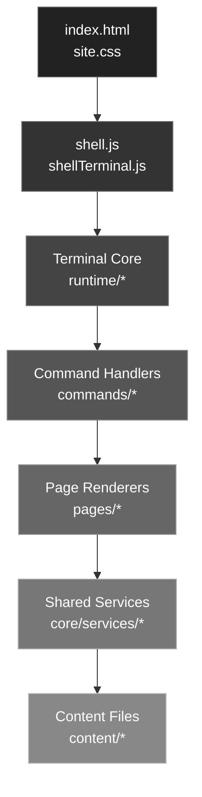
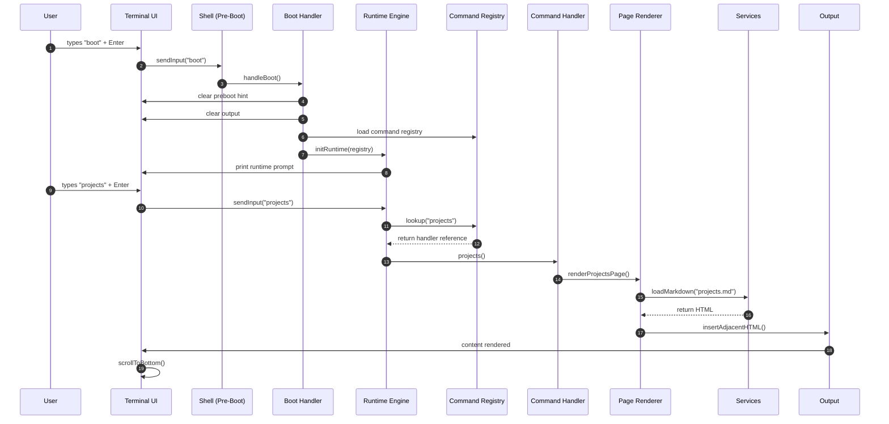

# 🚀 terminal-portfolio

A terminal‑style personal portfolio built with **vanilla JavaScript**, designed to feel like a real shell session rather than a traditional website.

This project explores how far you can push a fully static, framework‑free, dependency‑acyclic architecture while keeping the experience fast, expressive, and easy to extend.

The site is command‑driven, content‑first, and hosted as an **Azure Static Web Apps**.

---

## 🔦 Lighthouse Scores

---

## 🧠 Design Philosophy

- Terminal‑first UX — interaction over navigation
- Content‑driven — Markdown, JSON, ASCII
- Minimal JS — only what’s necessary
- Predictable architecture — no hidden state
- Performance as a feature — not an afterthought

---

## 🏆 Highlights & Achievements

- ⚡ Fast by design — tiny payload, minimal JavaScript, clean critical path
- 🧠 Predictable architecture — explicit layers, no circular dependencies
- 🎛️ Dynamic module loading — commands and pages load only when needed
- 🧱 Layered terminal engine — shell → engine → registry → handler → renderer → services
- 🧭 Static hosting only — no server, no backend, no runtime dependencies
- 🔒 Deterministic deploys — all content prebuilt, no runtime parsing
- 🧩 Build‑time content pipeline — Markdown → HTML during CI
- 📝 Content‑driven — Markdown, JSON, ASCII, and static HTML
- 🧭 Zero frameworks, zero bundlers — pure HTML, CSS, and ES modules
- 🧪 Automated Lighthouse CI — scores tracked on every commit

---

## 🛠️ Built With

- 🧰 Visual Studio Code — primary development environment
- 🌐 Vanilla JavaScript (ES Modules) — command routing, dynamic imports, and rendering
- 🖥️ HTML5 + CSS3 — semantic markup and terminal-style UI
- 📄 Markdown — content-driven pages (About, Help, Projects, Socials)
- ⚡ Azure Static Web Apps (SWA) — globally distributed hosting
- 🔁 GitHub Actions — CI/CD and automated Lighthouse audits
- 🧠 Dynamic Module Loading — deferred page loading for optimal LCP
- ♿ Accessibility-first design — semantic HTML, focus management, and keyboard navigation

---

## ✨ Features

- 🧭 Command‑based navigation
- 🧠 Autocomplete (TAB)
- ⬆️⬇️ Command history
- 📄 Markdown‑driven content pages
- 🧾 JSON configuration for links and metadata
- 💰 Coin API with animated progress bar + cooldown indicator
- 🎨 Theme switching (Retro, Azure, Vapor, Minimal, etc.)

---

## 🖥️ Available Commands

| Command | Description |
|-------|-------------|
| `welcome` | Displays the welcome banner |
| `about` | About Dusty and contact links |
| `projects` | GitHub projects list |
| `projects goto <n>` | Opens selected project |
| `resume` | Displays ASCII resume |
| `socials` | Social links list |
| `socials goto <n>` | Opens selected link |
| `coin` | Check the latest crypto price |
| `coin list` | List available crypto |
| `lighthouse` | View latest Lighthouse scores (production) |
| `theme` | Choose a theme |
| `gui` | Opens legacy GUI site |
| `clear` | Clears the terminal |
| `help` | Displays command help |

## ⌨️ Keyboard Shortcuts

| Key        | Action                     |
|------------|-----------------------------|
| `TAB`      | Autocomplete command names  |
| `ESC`      | Clear current input         |
| `↑` / `↓`  | Command history navigation  |

---

## 📄 Resume Pipeline

- ASCII source → HTML output
- CI built via Node.js in GitHub Actions
- Committed as static content
- Runs automatically in CI

---

## 🧪 CI/CD & Deployment

- Static hosting on Azure SWA
- Build‑time HTML generation
- Automated Lighthouse audits
- Deterministic deploys
- Zero server‑side code

---

## 🎯 Coin Rate Limit Demo

- A coin price request (coin btc, coin eth, etc.)
- A smooth animated progress bar that runs while the request is in flight
- Automatic transition from yellow → green as the request completes
- A clean, minimal cooldown indicator if the API rate limit is hit

---

## 🧱 Technical Architecture

The system is organized into explicit layers:
- Terminal Core — input, output, engine, prompt, telemetry
- Command Handlers — minimal, declarative, async
- Page Renderers — Markdown/HTML loaders
- Shared Services — config, markdown, templates
- Shared UI Utilities — scrolling, formatting
- Content Files — Markdown, YAML, ASCII, HTML

---

## 🧱Layered Architecture Diagram

Layer Responsibilities
UI Layer
- index.html, site.css
- Static shell markup and theme variables

Shell Layer
- shell.js, shellTerminal.js
- Wires DOM events into the terminal engine

Terminal Core
- Input parsing, dispatch, registry lookup, runtime orchestration
- Files under src/core/runtime/*

Command Handlers
- Minimal logic, async, declarative
- One folder per command under src/commands/*

Page Renderers
- Load static HTML generated from Markdown
- Insert into terminal output

Shared Services
- markdownService.js, configService.js, templateService.js
- Pure utilities with no DOM access

Content Files
- Markdown, YAML, ASCII, and static HTML
- Built into HTML during CI

---

## ⚡ Boot + Shell + Runtime Lifecycle

---