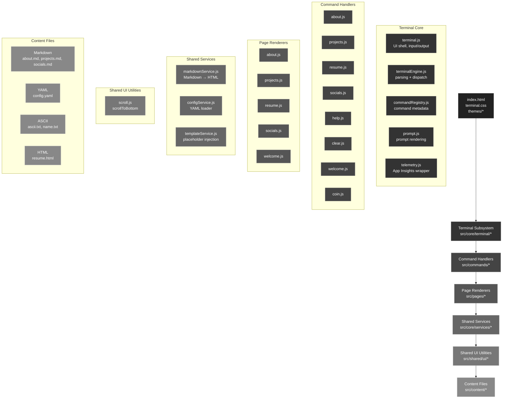
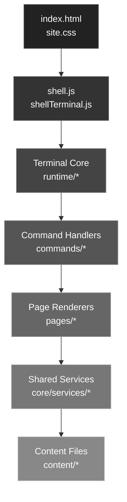
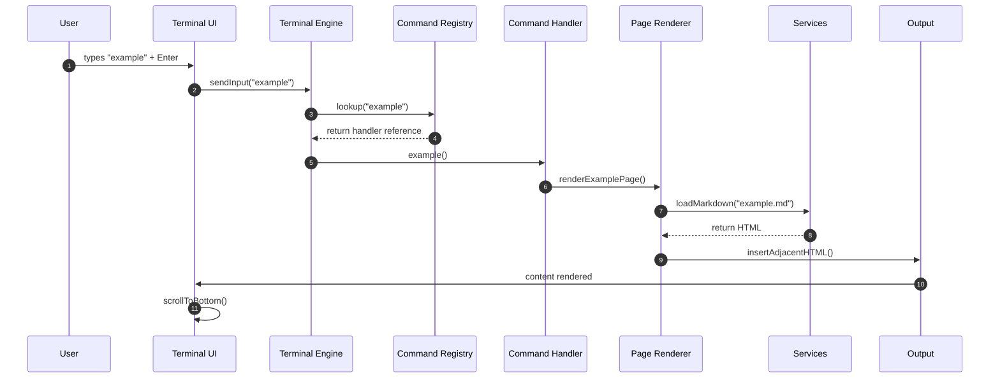
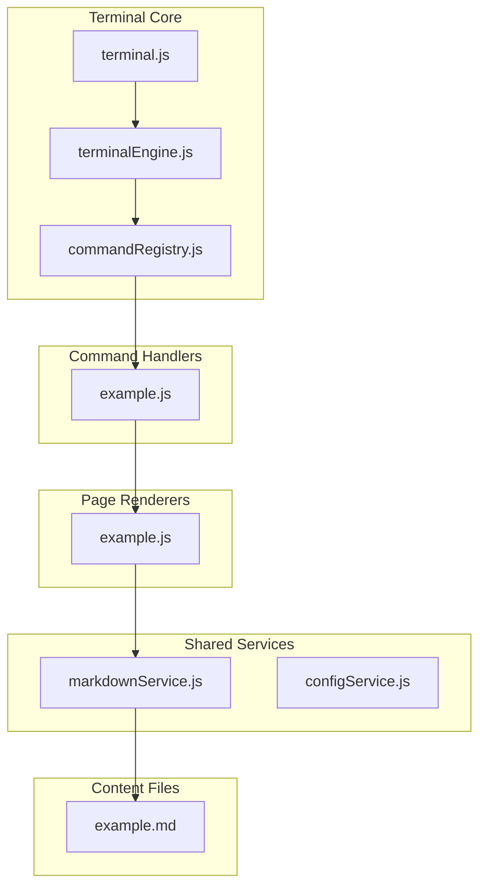

# 🚀 terminal-portfolio

A terminal‑style personal portfolio built with **vanilla JavaScript**, designed to feel like a real shell session rather than a traditional website.

This project explores how far you can push a fully static, framework‑free, dependency‑acyclic architecture while keeping the experience fast, expressive, and easy to extend.

The site is command‑driven, content‑first, and hosted as an **Azure Static Web Apps**.
---

## 🔦 Lighthouse Scores


---
## 🌟 Highlights & Achievements

⚡ Fast by design — tiny payload, minimal JavaScript, and a clean critical path
📝 Content‑driven — Markdown, YAML, ASCII, and static HTML
🧠 Predictable architecture — explicit layers, no circular dependencies
🧱 Command‑based UX — interaction over navigation
🧩 Build‑time content pipeline — Markdown → HTML during CI
🧭 Zero frameworks, zero bundlers — just HTML, CSS, and ES modules
🧪 Automated Lighthouse CI — scores tracked on every commit (SWA free tier may vary)
🎨 Theme‑Aware Terminal UI — themes all powered by CSS variables and zero JS

---

## 🛠️ Built With

This terminal-style portfolio was built using a modern, lightweight web stack with an emphasis on performance, accessibility, and developer ergonomics:

- 🧰 Visual Studio Code — primary development environment
- 🌐 Vanilla JavaScript (ES Modules) — command routing, dynamic imports, and rendering
- 🖥️ HTML5 + CSS3 — semantic markup and terminal-style UI
- 📄 Markdown — content-driven pages (About, Help, Projects, Socials)
- ⚡ Azure Static Web Apps (SWA) — globally distributed hosting
- 🔁 GitHub Actions — CI/CD and automated Lighthouse audits
- 📊 Lighthouse CI — performance, accessibility, and quality scoring
- 🧾 YAML Configuration — centralized config for commands and links
- 🧠 Dynamic Module Loading — deferred page loading for optimal LCP
- ♿ Accessibility-first design — semantic HTML, focus management, and keyboard navigation

---

## 🧠 Design Philosophy
- Terminal‑first UX — interaction over navigation
- Content‑driven — Markdown, YAML, ASCII
- Minimal JS — only what’s necessary
- Predictable architecture — no hidden state
- Performance as a feature — not an afterthought

---

## ✨ Features
- 🖥️ Terminal-style UI with persistent prompt
- 🧭 Command-based navigation
- 📄 Markdown-driven content
- 🧾 YAML configuration
- 🧱 Modular command architecture
- 🔍 GitHub project integration
- 📊 Lighthouse CI automation
- 🧠 Autocomplete (TAB)
- ⬆️⬇️ Command history
- 💰 Coin API with animated progress bar
- 🎨 Theme-aware design (Dark, Light, Vapor)
- ⚡ Zero frameworks, zero build step

---

## 🖥️ Available Commands

| Command | Description |
|-------|-------------|
| `welcome` | Displays the welcome banner |
| `about` | About Dusty and contact links |
| `projects` | GitHub projects list |
| `projects goto <n>` | Opens selected project |
| `resume` | Displays ASCII resume |
| `socials` | Social links list |
| `socials goto <n>` | Opens selected link |
| `coin` | Check the latest crypto price |
| `lighthouse` | View latest Lighthouse scores (production) |
| `theme` | Choose a theme |
| `gui` | Opens legacy GUI site |
| `clear` | Clears the terminal |
| `help` | Displays command help |

---

## 🧩 Dynamic Command System
Commands are declarative, lazy‑loaded, and follow a predictable lifecycle:
\```
User Input → Engine → Registry → Handler → Renderer → Output
\```

---

## 🧱 Technical Architecture
The system is organized into explicit layers:
- Terminal Core — input, output, engine, prompt, telemetry
- Command Handlers — minimal, declarative, async
- Page Renderers — Markdown/HTML loaders
- Shared Services — config, markdown, templates
- Shared UI Utilities — scrolling, formatting
- Content Files — Markdown, YAML, ASCII, HTML

This structure ensures:
- no circular dependencies
- predictable behavior
- clean separation of concerns
- easy extensibility

---

## 🛠️ Technology Stack
- Vanilla JavaScript (ES Modules)
- HTML5 + CSS3
- Markdown content pipeline
- Azure Static Web Apps
- GitHub Actions CI/CD
- Lighthouse CI automation
- YAML configuration
- Dynamic module loading
- ASCII‑driven resume

---

## 📄 Resume Pipeline

- ASCII source → HTML output
- CI built via Node.js in GitHub Actions
- Committed as static content
- Runs automatically in CI

---

## 🧪 CI/CD & Deployment

- Static hosting on Azure SWA
- Build‑time HTML generation
- Automated Lighthouse audits
- Deterministic deploys
- Zero server‑side code

---

## 🎯 Coin Rate Limit Demo

- A coin price request (coin btc, coin eth, etc.)
- A smooth animated progress bar that runs while the request is in flight
- Automatic transition from yellow → green as the request completes
- A clean, minimal cooldown indicator if the API rate limit is hit


---
🧱 Architecture Diagram

---
🧱Layered Architecture Diagram

---
🧭 Command Lifecycle Sequence Diagram (Mermaid)

---
🧱 Add New Command Architecture Flow Diagram (Mermaid)

---

## 🧪 Troubleshooting (Azure Static Web Apps)

### 🐳 Docker 403 Errors During Build

*failed to resolve source metadata for mcr.microsoft.com/appsvc/staticappsclient
403 Forbidden*

**Cause:** Intermittent Azure infrastructure issue  
**Fix:** Re-run the GitHub Actions workflow

This error occurs before application code is built and is not related to
JavaScript, Markdown, or configuration changes.

### ⚠️ Known Issues / Quirks (Azure + SWA)

- Azure SWA Docker image pulls may intermittently fail (403)
- Build cache behavior is opaque and non-configurable
- Absolute paths can behave differently locally vs hosted
- `skip_app_build: true` is recommended for static-only sites

None of these impact runtime once deployed successfully.

### 🔑 `deployment_token was not provided`

- Ensure the Azure Static Web Apps API token is present in repository secrets
- Confirm the workflow references the correct secret name

### 🚫 404 Errors for JavaScript Files in Production

- Verify `app_location` matches the directory containing `index.html`
- Ensure all runtime JS files are deployed under the same root
- Avoid absolute `/src/...` paths unless they exist in production

---

## ❓ Why this stack?

- Zero framework overhead — fast load times and minimal JavaScript
- Content-first architecture — Markdown over hardcoded UI
- CI-verified quality — Lighthouse scores tracked automatically
- Terminal-native UX — keyboard-driven, distraction-free interaction
- Production-focused — runs exactly as deployed, no mock data

---

## ❓ Why Terminal UI?

This project favors a terminal interface because it:

- Emphasizes interaction over navigation
- Encourages exploration through commands
- Avoids visual noise and layout complexity
- Reflects how engineers actually work

The terminal metaphor also keeps the architecture simple and explicit.

---

## ❓ Why ASCII Resume?

- Preserves alignment and formatting across environments
- Renders consistently in terminal-style UI
- Version-controlled, diff-friendly format
- Avoids PDF or framework-specific layouts

The resume is intentionally **content-first**, not presentation-driven.