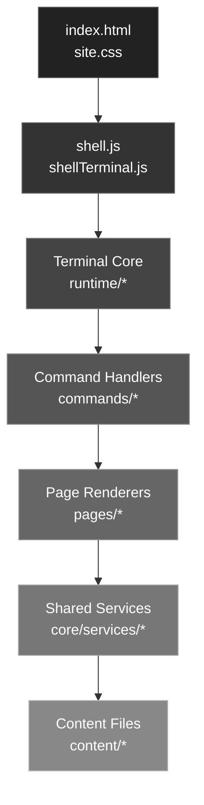
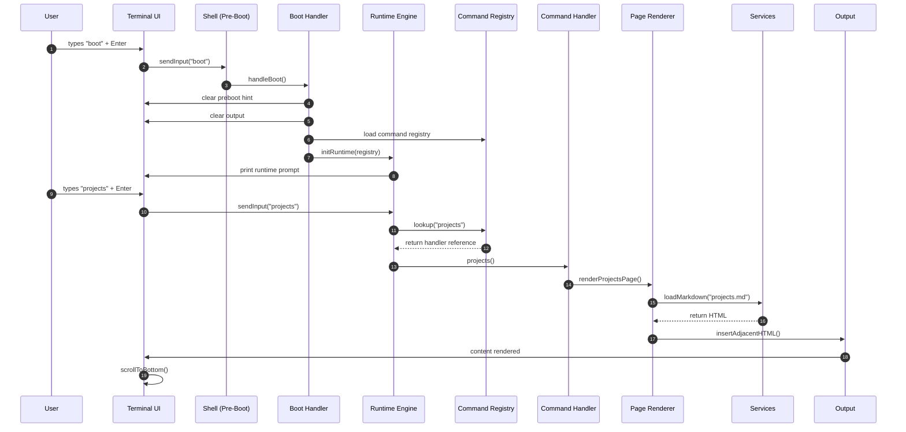

# 🚀 terminal-portfolio

A terminal‑style personal portfolio built with **vanilla JavaScript**, designed to feel like a real shell session.

The site is command‑driven, content‑first, and hosted as an **Azure Static Web Apps** with a tiny footprint and a clean, layered architecture.

---

## 🔦 Lighthouse Scores

---
## 🌟 Project Highlights

- 🖥️ Terminal‑first UX — HTML5 + CSS3 interaction over navigation
- 📝 Content‑driven system — Markdown, YAML/JSON, ASCII, and static HTML
- ⚡ Fast by design — tiny payload, minimal JavaScript, clean critical path
- 🧠 Predictable, dependency‑acyclic architecture — no hidden state, no circular imports
- 🧱 Layered terminal engine — shell → engine → registry → handler → renderer → services
- 🧩 Build‑time content pipeline — Markdown → HTML during CI for deterministic deploys
- 🎛️ Dynamic module loading — commands and pages load only when needed
- 🛠️ Zero frameworks, zero bundlers — pure HTML, CSS, and ES modules
- 🧭 Azure Static Web Apps (SWA) — Static hosting with no backend, no runtime dependencies
- ♿ Accessibility‑first design — semantic HTML, focus management, keyboard navigation
- 🔁 Automated CI/CD — GitHub Actions builds, tests, and runs Lighthouse audits
- 🌐 Vanilla JavaScript architecture — ES modules for routing, imports, and rendering

---

## 🖥️ Available Commands

| Command | Description |
|-------|-------------|
| `welcome` | Displays the welcome banner |
| `about` | About Dusty and contact links |
| `projects` | GitHub projects list |
| `projects goto <n>` | Opens selected project |
| `resume` | Displays ASCII resume |
| `socials` | Social links list |
| `socials goto <n>` | Opens selected link |
| `coin` | Check the latest crypto price |
| `coin list` | List available crypto |
| `lighthouse` | View latest Lighthouse scores (production) |
| `theme` | Choose a theme |
| `theme list` | View available themes |
| `gui` | Opens legacy GUI site |
| `clear` | Clears the terminal |
| `help` | Displays command help |

## ⌨️ Keyboard Shortcuts

| Key        | Action                     |
|------------|-----------------------------|
| `TAB`      | Autocomplete command names  |
| `ESC`      | Clear current input         |
| `↑` / `↓`  | Command history navigation  |

---

## 🧱 Technical Architecture

The system is organized into explicit layers:
- Terminal Core — input, output, engine, prompt, telemetry
- Command Handlers — minimal, declarative, async
- Page Renderers — Markdown/HTML loaders
- Shared Services — config, markdown, templates
- Shared UI Utilities — scrolling, formatting
- Content Files — Markdown, YAML, ASCII, HTML

---

## 🧱Layered Architecture Diagram

---

## ⚡ Boot + Shell + Runtime Lifecycle

---

## 🎯 BONUS: Coin Rate Limit Demo

- A coin price request (coin btc, coin eth, etc.)
- A smooth animated progress bar that runs while the request is in flight
- Automatic transition from yellow → green as the request completes
- A clean, minimal cooldown indicator if the API rate limit is hit

